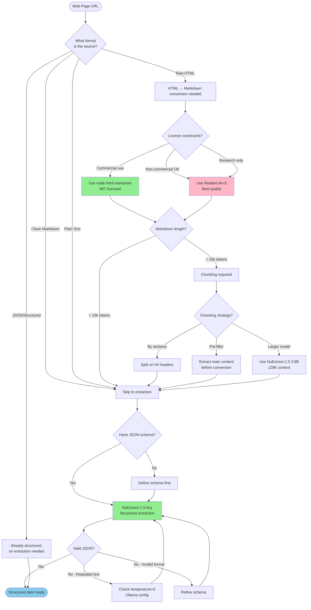

# Web Scraper Skill - Decision Guide

**Status**: Idea phase - NOT implemented
**Purpose**: Decide which tools to use for HTML→Markdown→JSON extraction

---

## Decision Flowchart



---

## What Each Tool Does

### NuExtract-1.5-tiny
**Purpose**: Markdown/Text → Structured JSON extraction
**Input**: Any text + JSON schema
**Output**: Filled JSON with extracted values
**License**: ✅ MIT (commercial use allowed)

### ReaderLM-v2
**Purpose**: Noisy HTML → Clean Markdown conversion
**Input**: Raw HTML (with ads, nav, scripts)
**Output**: Clean Markdown (semantic structure preserved)
**License**: ❌ CC BY-NC 4.0 (non-commercial only)

### node-html-markdown
**Purpose**: HTML → Markdown conversion (rule-based)
**Input**: HTML
**Output**: Markdown
**License**: ✅ MIT (commercial use allowed)

---

## Tool Comparison Matrix

| Criteria | node-html-markdown | ReaderLM-v2 | NuExtract-1.5-tiny |
|----------|-------------------|-------------|-------------------|
| **License** | ✅ MIT | ❌ CC BY-NC 4.0 | ✅ MIT |
| **Commercial use** | ✅ Allowed | ❌ Prohibited | ✅ Allowed |
| **Input format** | HTML | HTML | ANY text |
| **Output format** | Markdown | Markdown/JSON | JSON only |
| **Size** | ~50KB (library) | 935MB-3.1GB | 500MB |
| **Speed** | ⚡ Instant (rule-based) | 🐌 67/36 tok/s (T4 GPU) | ⚠️ Unknown (needs M2 validation) |
| **Context limit** | ♾️ Unlimited | 512K tokens | 8-20K tokens |
| **Quality** | ⭐⭐⭐ Good (rule-based) | ⭐⭐⭐⭐⭐ ROUGE-L 0.86 | ⭐⭐⭐⭐⭐ Beats GPT-4o with 40 examples |
| **Ollama support** | N/A (npm library) | ✅ milkey/reader-lm-v2 | ✅ sroecker/nuextract-tiny-v1.5 |
| **tinyArms status** | ✅ Recommended (MIT) | ❌ Excluded (license) | ✅ Recommended (MIT) |

---

## Pipeline Options

### Option A: MIT-Licensed (Commercially Viable)
```
HTML → node-html-markdown → Markdown → NuExtract-1.5-tiny → JSON
       (npm library, instant)           (500MB MIT model)
```

**Trade-offs**:
- ✅ MIT licensed (unlimited commercial use)
- ✅ Fast (rule-based parser, no LLM for HTML step)
- ✅ Small footprint (500MB model only)
- ⚠️ Lower HTML→Markdown quality vs ReaderLM-v2 (estimated 10-30% worse)
- ⚠️ Context limit: 8-20k tokens (requires chunking for long pages)
- ⚠️ Rule-based parser struggles with very noisy HTML

---

### Option B: License-Blocked (Best Quality, Non-Commercial Only)
```
HTML → ReaderLM-v2 → Markdown → NuExtract-1.5-tiny → JSON
       (935MB, CC BY-NC 4.0)   (500MB MIT)
```

**Trade-offs**:
- ✅ Best HTML→Markdown quality (ROUGE-L 0.86, 24.6% better than GPT-4o)
- ✅ 512K context (no chunking needed)
- ✅ Handles noisy HTML with semantic understanding
- ❌ **LICENSE BLOCKER**: CC BY-NC 4.0 prohibits commercial use
- ⚠️ Slower (LLM inference: 67 tok/s input, 36 tok/s output on T4 GPU)
- ⚠️ Larger total size (1.4GB)

---

### Option C: Extended Context (MIT, Larger Model)
```
HTML → node-html-markdown → Markdown → NuExtract-1.5 (3.8B) → JSON
       (npm library, instant)           (2.18GB MIT model)
```

**Trade-offs**:
- ✅ MIT licensed
- ✅ 128K context (validated, less chunking needed)
- ⚠️ Larger model (2.18GB vs 500MB)
- ⚠️ Slower inference (estimated, needs M2 validation)
- ⚠️ Same HTML→Markdown quality issues as Option A

---

## When They Work Together vs Alone

### NuExtract alone (no HTML parsing)
- Extract from API responses (already JSON/text)
- Parse log files (plain text)
- Extract from Markdown docs (already clean)
- Parse config files (YAML, TOML)

### node-html-markdown alone (no extraction)
- Convert documentation to Markdown
- Archive web content for reading
- Prepare HTML for human consumption

### Full pipeline (HTML → Markdown → JSON)
- Scrape structured data from websites
- Extract article metadata
- Parse API documentation
- Build datasets from web pages

---

## Key Constraints from Research

### NuExtract-1.5-tiny
- **Context limit**: 8-20k tokens (from nuextract.md:37)
- **Critical config**: Must use `temperature: 0` (Ollama defaults to 0.7 cause issues)
- **Output**: 100% valid JSON (copy-paste only, zero hallucinations)
- **Ollama**: `sroecker/nuextract-tiny-v1.5`

### ReaderLM-v2
- **Context**: 512K tokens (no chunking needed)
- **Quality**: ROUGE-L 0.86 vs GPT-4o's 0.69
- **License blocker**: CC BY-NC 4.0 = no commercial use
- **Speed**: 67 tok/s input, 36 tok/s output (T4 GPU)

### node-html-markdown
- **License**: MIT (npm package)
- **Speed**: 1.57x faster than Turndown (from research)
- **Performance**: 176ms for 1MB HTML
- **Quality**: "Clean, concise output" (library claim, not benchmarked)

---

## Open Questions (Need Validation)

1. **M2 Air performance**: All speed/memory estimates unvalidated
2. **HTML quality gap**: "10-30% worse" is speculation, not measured
3. **Chunking strategy**: Best approach for long documents unknown
4. **Integration patterns**: tinyArms CLI syntax undecided

---

## References

- **NuExtract research**: `docs/model-research/nuextract.md`
- **ReaderLM-v2 research**: `docs/model-research/readerlm-v2.md`
- **Model index**: `docs/model-research/index.md` (Web Scraping section)
- **node-html-markdown**: https://github.com/crosstype/node-html-markdown (MIT)
- **Turndown**: https://github.com/mixmark-io/turndown (MIT)

---

**Last Updated**: 2025-10-28
**Status**: Decision guide only - no implementation yet
